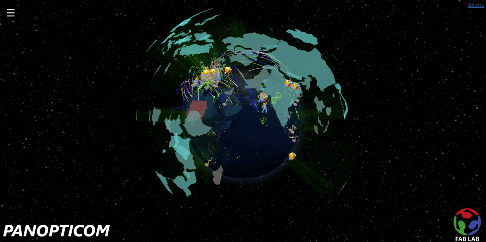
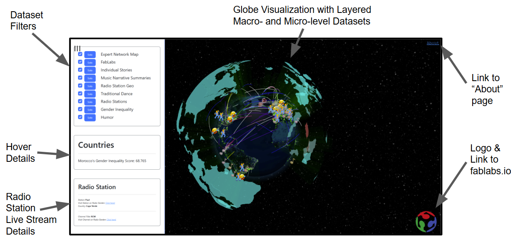

# Panopticom

***This is a copy of the Panopticom GitLab repo to be submitted as a part of my (Adam Stone's) MIT Maker Portfolio.***

## Project Overview

The Panopticom, a collaboration between Genesis singer Peter Gabriel and MIT Professor Neil Gershenfeld, is a digital platform that brings to life the concept behind Peter song, Panopticom.

The Panopticom is a website that illuminates macro- and micro-level trends and data. It consists of an engaging global data visualization that is modular in structure, allowing for easy integration of new information.

Panopticom 2.0 will enable users around the world to optimize decision-making by discovering the interconnectedness of seemingly disparate information.

## Project Details

To see the live site, click here: [`https://panopticom.fabcloud.io/`](https://panopticom.fabcloud.io/)

High level oveview here: [`https://petergabriel.com/focus/the-panopticom/`](https://petergabriel.com/focus/the-panopticom/)

### Demo Videos & Presentations

- [Fab24 International Conference and Symposium Presentation 8/7/24](https://youtu.be/nbQp-KVpF2M)
- [Glacier Use Case Demo 7/26/24](https://drive.google.com/file/d/1NAW16UddEX_Dj0WP-a5uR5KRswMTh6ge/view?usp=sharing)
- [Mockup Dashboard Interface Demo 7/19/24](https://drive.google.com/file/d/18YYwntT1GNpr8u8qol1IaIc5K7mkMG3n/view?usp=drive_link)
- [Prototype Demo 7/12/24](https://drive.google.com/file/d/1xNujsCFeTyHFPEHz83GBcIdpUmu3eIhG/view?usp=drive_link)

## Getting Started

### How to run the visualization:

1. Clone repo
2. Run `npm i` then `npm run dev` in the root directory of the cloned repo
3. Navigate to [`localhost:5173`](http://localhost:5173) in Google Chrome

### How to use the visualization:

The visualizations consists of a globe, and users can scroll anywhere in the world to see data for that geography. By zooming in and out, different layers become visible, and by clicking or hovering on data points, more detail becomes visible in the menu or in a popup. Top left of screen has a button to open the menu that allows for filtering data layers and seeing additional details.

- Zoom in and out to see micro- and macro-level datasets overlaid
- Hover over data points to see details in the menu panel on the left
- Click on personal stories, humor, traditional dance, or popular music summaries to see additional details
- Scroll anywhere on the globe to hear a radio live stream of the closest station to your position
- Use the menu filters to activate or deactivate different data layers
    - The check-boxes toggle each dataset
    - The `solo` button highlights only that dataset when clicked

### Contributing data (`JSONL Schema` overview):

The Panopticom backend supports the rapid integration of data sets that comply with the following `JSONL Schema`. 

By adding datasets to the [`public/datasets/formatted_datasets`](./public/datasets/formatted_datasets/) directory and listing them in [`main.jsx`](./src/components/main.jsx), they will automatically populate onto the global visualization.

- [Click here for the human-readable `JSONL` schema!](./standardized_json.md)
- [Click here for the technical `JSONL` schema](./dev/jsonSchema.json), and use a tool such as [this validator](https://www.jsonschemavalidator.net/) to ensure your dataset complies

## Repo Organization

This project consists of scraping datasets, formatting the datasets for rapid integration (using the `JSONL Schema`), and the global visualization of the datasets.

The scraping and formatting code is contained in the [`dev`](./dev/) directory:
- the [`JSONL Schema`](./dev/jsonSchema.json)
- datasets formatted to the `JSONL Schema` specification in the [`dev/datasets`](./dev/datasets/) directory 
    - (the final datasets are moved to the [`public/datasets/formatted_datasets`](./public/datasets/formatted_datasets/) directory)
- the Python code used to format the datasets in the [`dev/reshape_data`](./dev/reshape_data/) directory
- example projects and brainstorming documents in the [`dev/brainstorm`](./dev/brainstorm/) directory
- early attempt at using D3JS for the global visualization in the [`dev/D3JS-test`](./dev/D3JS-test/) directory
- experiments interfacing geolocated data with the OpenAI API in [`dev/python-tests/gpt-interface`](./dev/python-tests/gpt_interface/)

The visualization code is contained in the [`src`](./src/) directory:
- [`main.jsx`](./src/main.jsx) contains links to the formatted dataests
- [`App.jsx`](./src/App.jsx) contains the main program code that links to other React components in the [`src/components`](./src/components) directory.

## Contributions and Acknowledgements

- Modules
    - [ThreeJS](https://d3js.org)
    - [NodeJS](https://nodejs.org)
    - [ReactJS](https://react.dev/)
    - [Vite](https://vitejs.dev/)
    - [Bootstrap](https://getbootstrap.com/)
    - [GlobeGL](https://globe.gl/)
- Data Sources
    - [Fab Lab Locations - Fablabs.io](https://fablabs.io/)
    - [Expert Network Map] **PUT THE CORRECT LINK HERE**
    - Personal Stories
    - [Music Narrative Summaries - Billboard & ChatGPT 4.0](https://www.billboard.com/)
    - [Global Radio Station Live Streams - radio.garden](https://radio.garden/)
    - Traditional Dance Around the World - ChatGPT 4.0
    - [Global Gender Inequality - The World Bank Atlas of Sustainable Development Goals](https://datatopics.worldbank.org/sdgatlas)

We would like to thank the following sites and projets for inspiration and/or sources of input:

- [The Expert Network Map](https://pub.fabcloud.io/project/expert-network-map/)
- [The FMCU (the Frankenstein MCU)](https://fmcu.fablabs.io/)
- [Radio Garden](https://radio.garden/?r=1)
- [The World Bank Atlas of Sustainable Development Goals](https://datatopics.worldbank.org/sdgatlas/goal-5-gender-equality?lang=en)
- [Earth :: a global map of wind, weather and ocean conditions](https://earth.nullschool.net/)